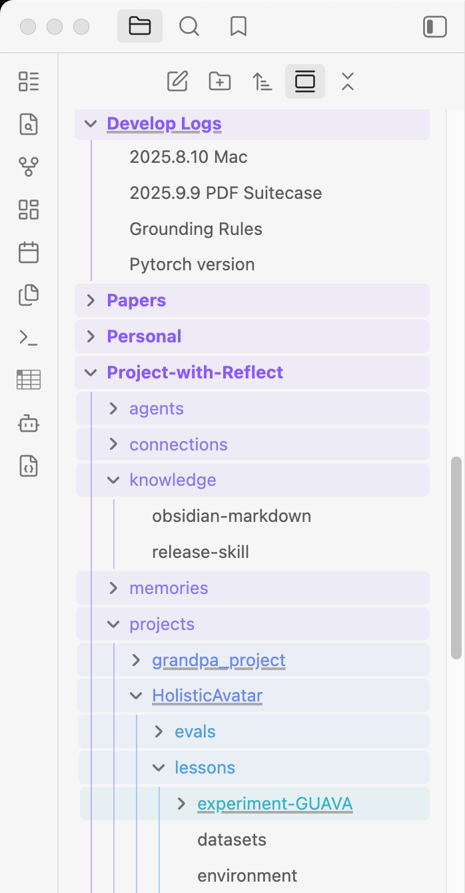

# Neat File Tree

Small quality-of-life tweaks for Obsidian's file explorer that make a deep, busy
vault easier to navigate.

  

## Features

- **Sticky folder headers** — parent folders pin to the top as you scroll,
  stacked by depth, just like VSCode's "sticky scroll". You never lose track of
  where you are when many folders are expanded.
- **Per-depth color schemes** — folder names, their bar, and the indentation
  guide lines are colored by depth from a scheme you pick: **Aurora** (the
  default, anchored to your theme's accent), **Rainbow**, **Ocean**, **Sunset**,
  **Forest**, or **Mono** — chosen from a live preview in settings. Top-level
  folders stay bold so the roots of your vault stand out.

Each feature has its own toggle in the plugin settings, plus a **Row height**
field to keep the sticky headers aligned if you use a larger interface font.

## Install

### From Community Plugins (once approved)

Settings → Community plugins → Browse → search "Neat File Tree" → Install →
Enable.

### Manual

1. Download `main.js`, `manifest.json`, and `styles.css` from the latest
   [release](../../releases).
2. Copy them into `<your-vault>/.obsidian/plugins/neat-file-tree/`.
3. Reload Obsidian and enable the plugin in Settings → Community plugins.

## How it works

The plugin is pure CSS toggled by body classes — no DOM manipulation, no
performance cost. It respects your theme's accent color (`--text-accent`) and
background variables, so it adapts to light/dark and custom themes
automatically.

## License

MIT
